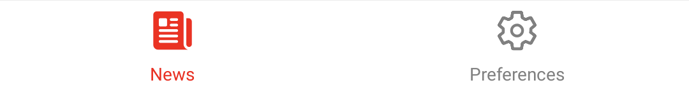
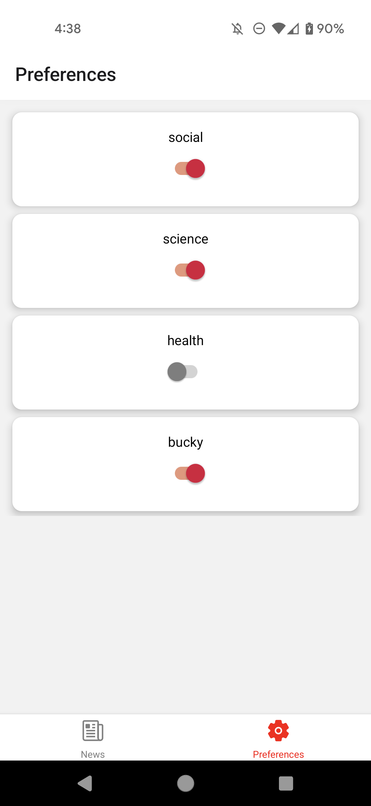

#   Badger News App


## Badger News

In this directory, simply run...

```bash
npm install
npm start
```


## Features

### 1. Navigation

Allows the user to navigate between two tabs: a tab for "News" and a tab for "Preferences".



### 2. News Card List

Fetches the short news article summaries and displayed them to the screen as a card, including their image and title text.


### 3. Read News Article

When a news story is selected, the user is brought to another screen using _a nested Stack Navigator_. This screen shows the author, posting date, and body paragraphs fetched from an API. 
Additionally, the user is displayed a message along the lines of "The content is loading!" while waiting for the body paragraphs to load. After finishing reading the article, the user is able to to return to the list of short summaries. If they re-visit the story, the animation occurs again.


### 4. Apply Preferences

The user is able to apply their news preferences via the "Preferences" tab. This tab displays switches (**on:** opt in, **off:** opt out) for each of the unique tags.

By default, the user opts in to all content. However, the user is able to toggle their preferences on and off. If the user has a preference toggled off, _any_ news story with that tag is _not_ be displayed to the user. If the user's preferences are so restrictive that there are no articles to be displayed, a message is displayed saying so.




### 5. URL

I have added some text that says "Read full article here." linking to the URL of the article on [news.wisc.edu](https://news.wisc.edu/). 

